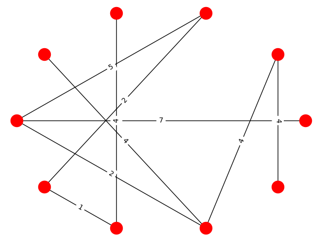

# theknightdawns

## information: 
An amazing game. NOTE: the makefile is very broken, `make clean` every time you get an error.


## N.B.
Let G(V,E) be a bidirectional weighted graph. I represent G with an ajacency matrix where `A[i][j]` describes the cost of travelling from vertex `i` to vertex `j`. Basically the only biderectional weighted graph that I have is a graph where each vertex represents a teleporter, and an edge is either
  1) If the teleporters are in the same room it is the taxicab (approx same as euclidean, satisfies triangle inequality) distance between the teleporter's entrances
  2) If the teleporters are not in the same room then if teleporter `i` leads to the room that teleporter `j` is in `A[i][j]` is the distance from the exit of teleporter `i` to the entrance to teleporter `j` and `A[j][i]` is probably `0`.
  3) 0 represents a teleporter that is not dirrectly reachable from another teleporter
  4) note: no self loops
  5) note: it is probably a connected grpah (or that would be a waste of the game design... )
  6) note: metric inequality DOES NOT HOLD in general. beccause why would teleportation obey the triangle inequality!!!
  7) Note again that the matrix is NOT symmetric. Be careful!!

## how to play it:
  * Follow installation directions below
  * run `sh main.sh` and follow specified directions
  * OR if you want, just make a json for your account (or even don't, if you pass no username to main.cpp then it will make your username `null`) run `make` and then `./main username`


## how to install it:
### TL;DR
#### Mac
```
git clone https://github.com/awestover/theknightdawns.git
/usr/bin/ruby -e "$(curl -fsSL https://raw.githubusercontent.com/Homebrew/install/master/install)"
brew tap nlohmann/json
brew install nlohmann-json
brew install sfml
```
If the installation of sfml did not work, Install [sfml](https://www.sfml-dev.org/download/csfml/) from their website, and either get it with the rest of your cpp stuff or move the file with the necessary hpps and stuff (it should be include/SFML) to the dirrectory where you cloned my code

#### Linux
  * Install [json lib](https://github.com/nlohmann/json) with your package managerj
  * Install [sfml](https://www.sfml-dev.org/download/csfml/) and either get it with the rest of your cpp stuff or move the file with the necessary hpps and stuff (it should be include/SFML) to the dirrectory where you cloned my code

1) Install brew
  * yes no matter what OS you are on (If you have a Linux based OS you can try using whatever package manager you like e.g. apt-get for Ubuntu, but I just installed brew because my Linux machine's apt-get is 1000% broken).
  * to install brew on a mac run the following command from your terminal: `/usr/bin/ruby -e "$(curl -fsSL https://raw.githubusercontent.com/Homebrew/install/master/install)"`
    - if it doesn't work try `sudo /usr/bin/ruby -e "$(curl -fsSL https://raw.githubusercontent.com/Homebrew/install/master/install)"` and then input your computer's password 
    - see [Homebrew docs](https://brew.sh) for more info
  * to install brew not on a mac (i.e. Linux, Windows(???)) run `sh -c "$(curl -fsSL https://raw.githubusercontent.com/Linuxbrew/install/master/install.sh)" ` and then run 

```bash 
test -d ~/.linuxbrew && eval $(~/.linuxbrew/bin/brew shellenv)
test -d /home/linuxbrew/.linuxbrew && eval $(/home/linuxbrew/.linuxbrew/bin/brew shellenv)
test -r ~/.bash_profile && echo "eval \$($(brew -prefix)/bin/brew shellenv)" >>~/.bash_profile
echo "eval \$($(brew -prefix)/bin/brew shellenv)" >>~/.profile
``` 

- see [Linux brew docs](https://docs.brew.sh/Homebrew-on-Linux) for more info.

2) Install the json library that I use
  * with brew its as simple as 
  `brew tap nlohmann/json`
  `brew install nlohmann-json`
  * see [the project on github](https://github.com/nlohmann/json) for more info
  * if this doesn't work try just cloning the project

3) Install sfml
  * it might be as simple as `brew install sfml`
  * if not, install it from [sfml download site](https://www.sfml-dev.org/download/csfml/)
    - if you follow this route then unforunately you will probably get a bunch of files, which are all the files that you need, but can't be included with <>

## documentation
### file I/O
  Beautiful tool for jsons:
    https://github.com/nlohmann/json
  `brew tap nlohmann/json`
  `brew install nlohmann-json`

### rendering 
  view: center
  viewPort: topleft corner
  sprites: top left corner
  text: top left corner

  - moral of the story: views are the only thing that need a center

## object instantiation
  saying 
  Player test;
  would run the initialization code for player (if it required no arguments);

### header gaurd files
  `#define HUD` will destroy
  `class HUD{}`
  because they have the same name!!!

  instead do 
  `#define HUD_H`

## transformation matrices:
To specify all possible 2d transformation we need a 3 by 3 matrix.
Translation:
```
[[1,0,tx],
[0,1,ty],
[0,0,1]]
```
Scale:
```
[[sx,0,0],
[0,sy,0],
[0,0,sz]]
```
Rotation:
```
[[cosx,-sinx,0],
[sinx,cosx,0],
[0,0,sz]]
```
Shear:
```
[[1,shx,0],
[shy,1,0],
[0,0,1]]
```
One should NOTE:
points are represented as 3 by 1 matrices (i.e. vectors) IN CONTRAST to in opengl where they are represented as the transpose of this
so everything is mathy and normal UNLIKE opengl
also, matrix multiplication satisfies that 
doing `T_a` and then `T_b` 
is the same as just doing `T_b*T_a`	

## how to add a sprite
  put a bunch of imgs in 
  data/imgs

  use pyForms/horizontalConcat.py prefix directory
  to concat frames into a row

  modify pyForms/concatVertical.py
  to your needs

  run pyForms/imgDims.py
  for help

***************************************************************************************************
***************************************************************************************************
***************************************************************************************************
#### TODO

## make it possible to input a game map as a pixel grid, and have python read in the pixel colors (approximate what red is, probably kmeans is overkill / trash just go for whatever is closest...)
eg a black pixel / rect could mean "rock"
and a red pixel could mean "battle portal"
etc
visual design is just easier

### add story line & design
  - croud sourced???

### Quest arrow
  - Dijkstras!!!!

### battle mode
    - first of all what stats should they even have
    - how does inventory play into it?
    - i think questing should level up character base health etc
    - in fight some actions could be
        - summon minions
            - chalkling circle
        - shoot / cast magic spell
        - build defenses
        - go up and hit with sword

### add inventory

        - gets stored in userData

### make sure we aren't rendering stuff off screen!!

  - eh Cpp is fast, this isn't really a priority atm since worlds are at most like 16 (?) times the size of the view
  - but later: "sure why not"

***************************************************************************************************
***************************************************************************************************
***************************************************************************************************

